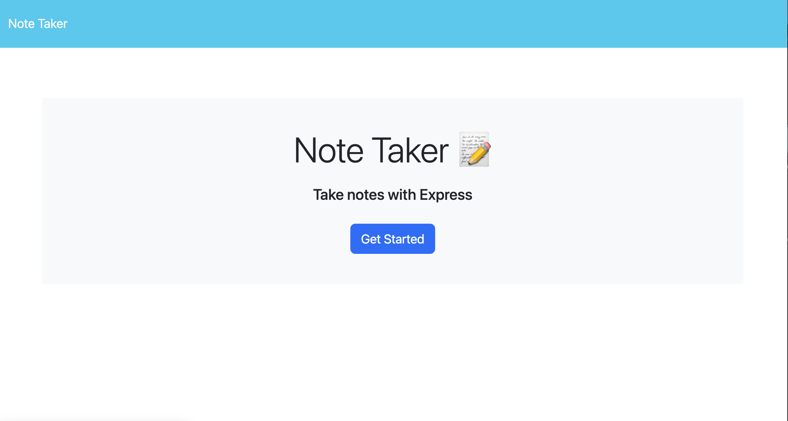
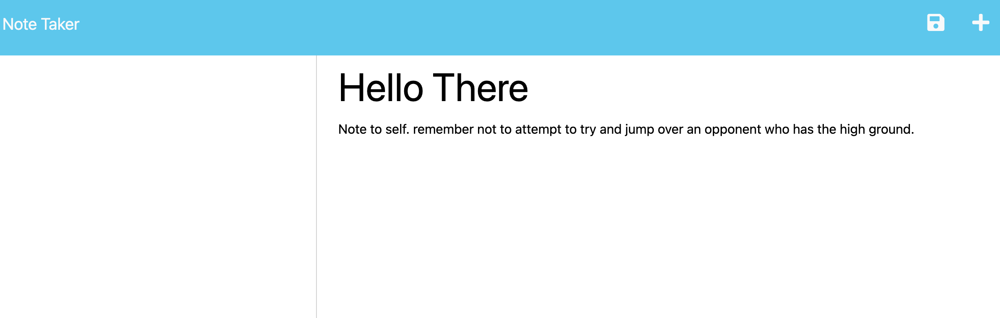

## License

This project is licensed under the terms of the [MIT](https://opensource.org/licenses/MIT) license.

---

# Notepad
[CLICK ME! to see the site](https://notepad-trotz-fc1f6bad22f5.herokuapp.com/)

## Description

Simple application for taking notes using Express js. Notes are saved and stored in a Database Json file and retreved and displayed using a Modular Routing structure. As of time of writting project lacks proper connection to Database file. 

---

## Table of Contents

- [installation](#installation)
- [Usage](#usage)
- [License](#license)
- [Contributing](#contributing)
- [Questions](#questions)

## Installation

Click the link below for the notpad GitHub page. Download project from GitHub and use npm install for modules.

[GitHub Notepad](https://github.com/Widewanderer/Notepad)

---

## Usage

Interface is fairly straight forward. Click the "Get Stared" button on homepage to enter site. Enter notes and note title on the right side of page. Previously made notes will be displayed on the left side. 

---

## Contributing

If your want to contribute. Email created using email provided below.

Past contributions include

- Erik Hirsch

---

## Questions

Github
Github: [Widewanderer](https://github.com/Widewanderer)

Email
If you have any additional questions project creator can be reached by email at [suvorov13@yahoo.com](mailto:suvorov13@yahoo.com)
